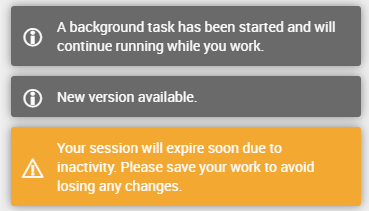

# WebToast Library

Add toasts to your web application. Toasts are floating notification boxes that usually hide after a few seconds. This library provides an API to display them easilly from DataFlex within your Web Framework Applications.

## Usage Example

```
Use cWebToast.pkg

Object oToaster is a cWebToast
    Set pePosition to wtpTopRight
    Set piWidth to 350
End_Object

Send ShowInfoToast of oToaster "A background task has been started and will continue running while you work."

Send ShowInfoToast of oToaster "New version available."

Send ShowWarningToast of oToaster "Your session will expire soon due to inactivity. Please save your work to avoid losing any changes."
```


## General Information

| Product  | Version           |
| -------- | ----------------- |
| DataFlex | 26.0  |
